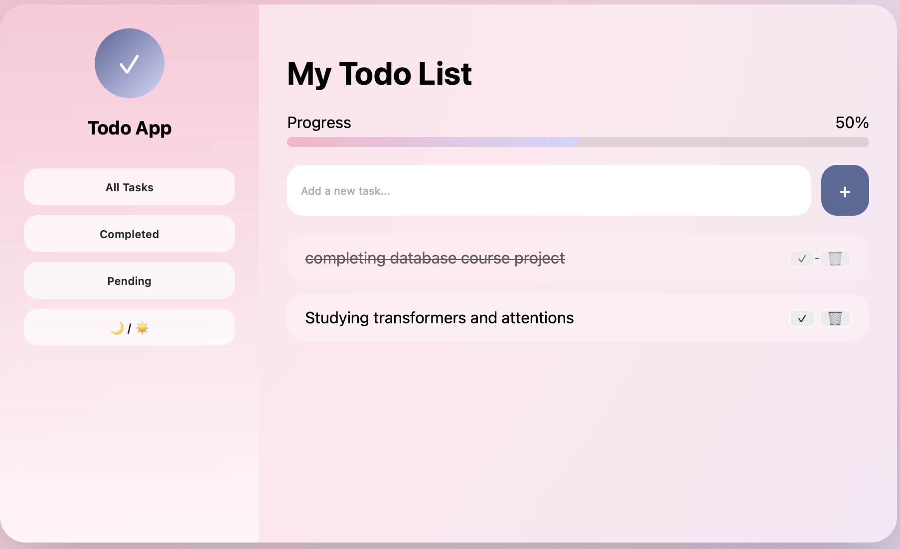

# 📝 Todo App – Full Stack Project

A full-stack **Todo Application** built with **Node.js, Express, MongoDB, and a modern animated frontend UI**, fully **Dockerized** and following a **Git feature-branch workflow**.

This project was developed as part of an academic assignment with strict requirements on Git usage, Docker, and clean project structure.
## 📸 todo list



---

## 🚀 Features

### Backend (API)

* RESTful CRUD API using **Express.js**
* MongoDB database (running in Docker container)
* Mongoose ODM for schema & data modeling
* Clean project structure (routes, models, config)

### Frontend (UI)

* Modern **Glassmorphism UI**
* Animated floating background blobs
* Progress bar showing task completion percentage
* Hover & micro-interactions
* Dark / Light mode toggle
* Fully separated CSS file (for better maintainability)

### DevOps & Workflow

* Dockerized backend & MongoDB
* **Docker Compose** for multi-service orchestration
* Git **feature branch workflow**
* Pull Request based development

---

## 🧱 Tech Stack

**Frontend**

* HTML5
* CSS3 (Animations, Glass UI)
* Vanilla JavaScript

**Backend**

* Node.js
* Express.js
* MongoDB
* Mongoose

**DevOps**

* Docker
* Docker Compose
* Git & GitHub

---

## 📂 Project Structure

```bash
todo-app/
│
├── backend/
│   ├── src/
│   │   ├── models/
│   │   ├── routes/
│   │   ├── config/
│   │   └── index.js
│   ├── Dockerfile
│   └── package.json
│
├── frontend/
│   ├── index.html
│   ├── styles.css
│   └── script.js
│
├── docker-compose.yml
└── README.md
```

---

## 🐳 Docker Setup

### Services

* **backend** – Express API
* **mongo** – MongoDB database

### Run the project

```bash
docker compose up --build
```

Backend will be available at:

```
http://localhost:5001
```

---

## 🔗 API Endpoints

| Method | Endpoint       | Description       |
| ------ | -------------- | ----------------- |
| GET    | /api/todos     | Get all todos     |
| POST   | /api/todos     | Create a new todo |
| PUT    | /api/todos/:id | Update a todo     |
| DELETE | /api/todos/:id | Delete a todo     |

---

## 🧪 Example Request

```bash
curl -X POST http://localhost:5001/api/todos \
-H "Content-Type: application/json" \
-d '{"title":"Learn Software Engineering"}'
```

---

## 🌿 Git Workflow

* `main` → stable branch
* `feature/full-project-setup` → development branch
* All changes merged via **Pull Request**
* Clean and descriptive commit history

---

## 📸 Screenshots

> Screenshots of the Pull Request, UI, and running containers are included for grading purposes.

---

## 👩‍💻 Author

**Sayna Sarvar**

GitHub: [https://github.com/SaynaSarvar](https://github.com/SaynaSarvar)

---

## ✅ Project Requirements Checklist

* [x] Git version control
* [x] Feature branching
* [x] Pull Request workflow
* [x] Dockerized services
* [x] MongoDB (non-local)
* [x] Clean architecture
* [x] Frontend animations & UI

---

✨ This project demonstrates a complete modern web development workflow from UI to deployment-ready backend.
